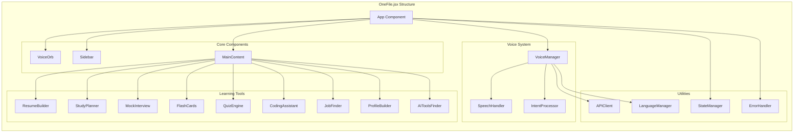
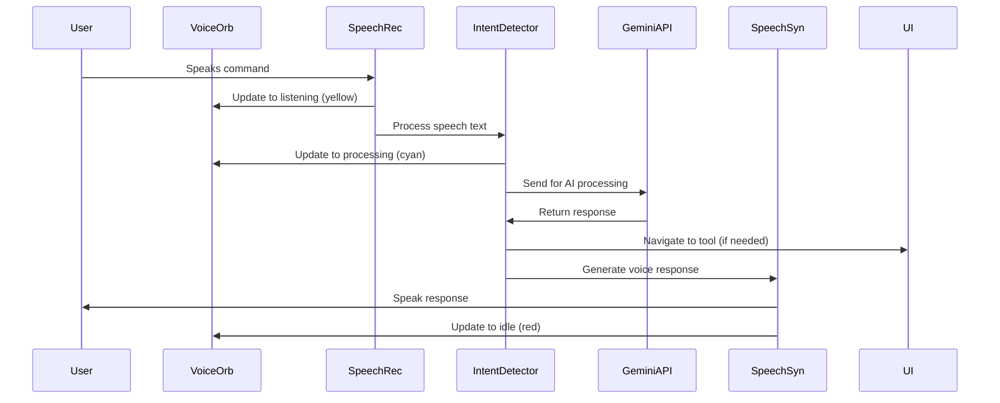
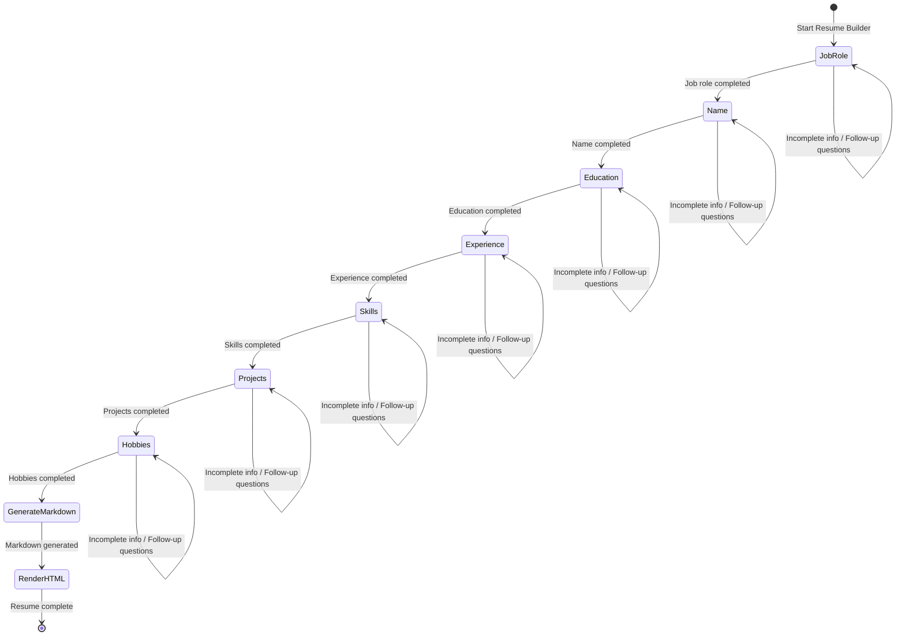
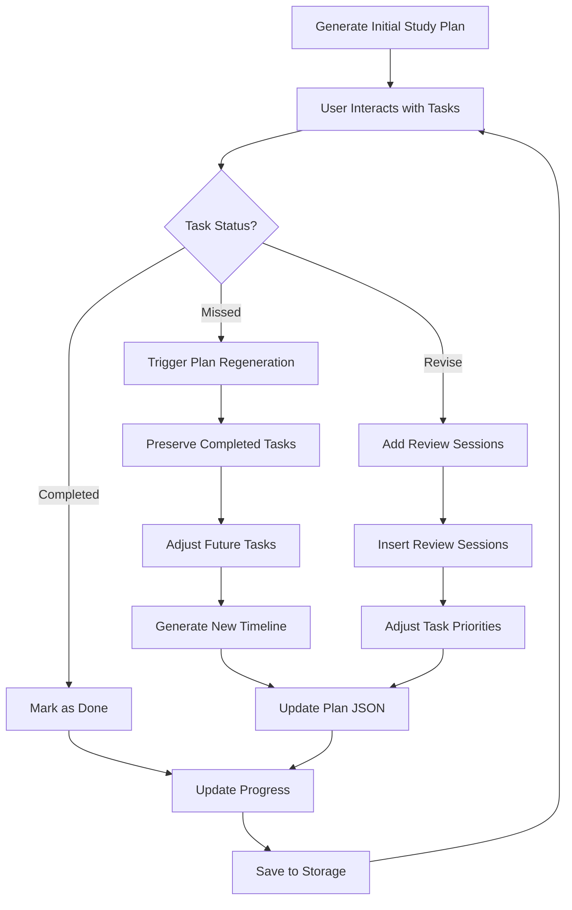
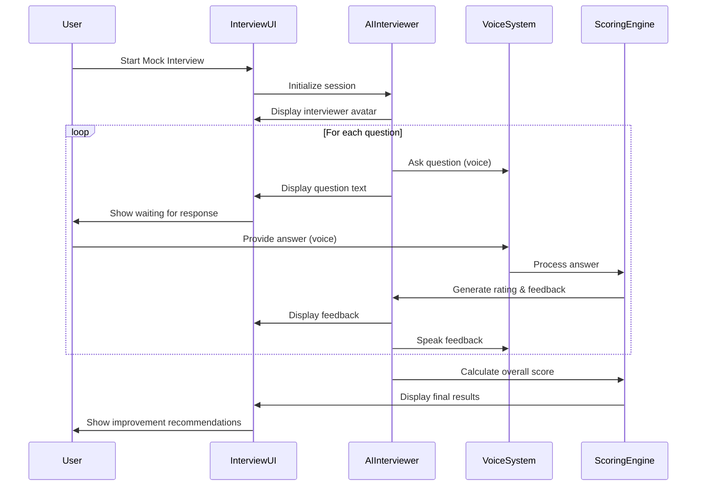
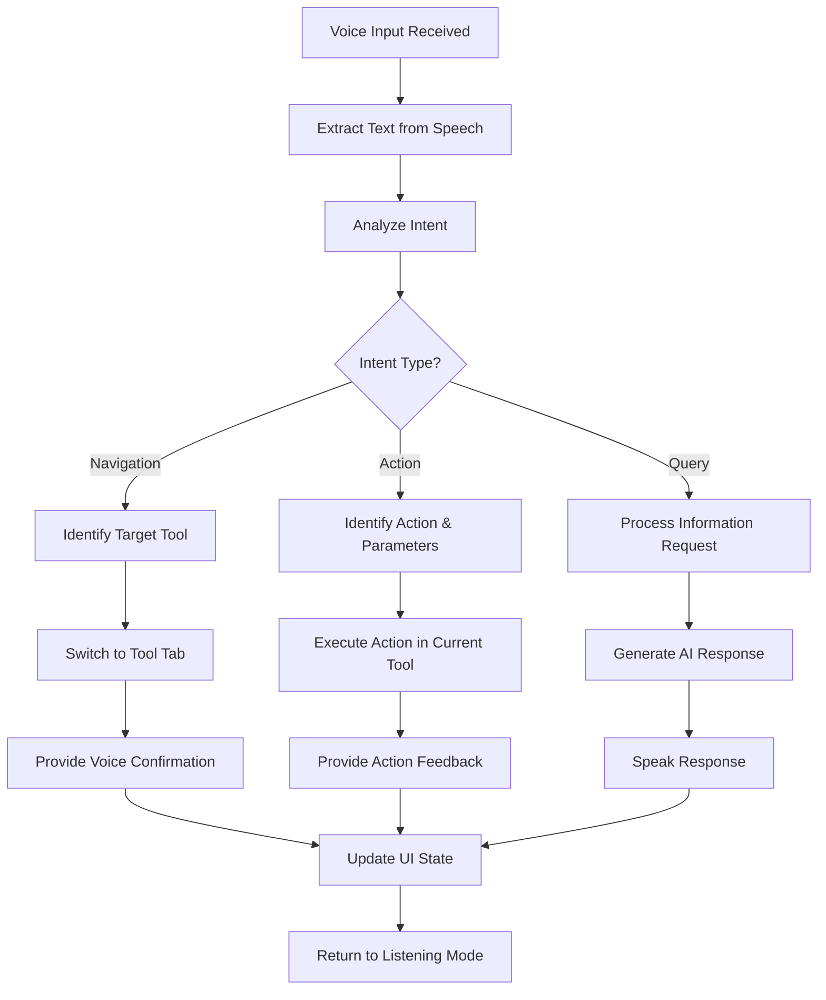
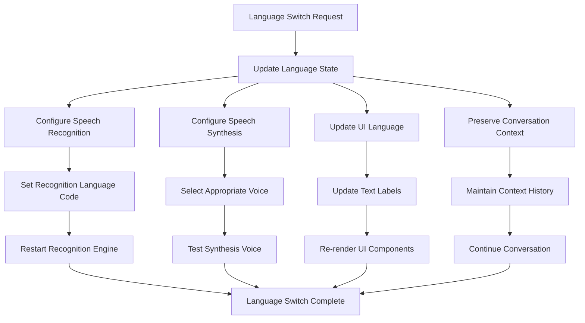
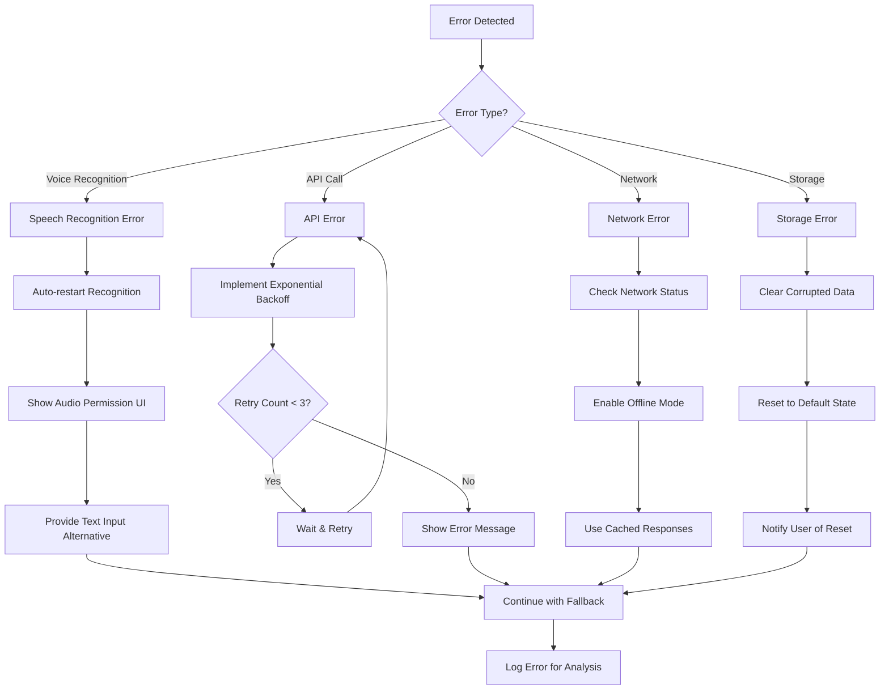
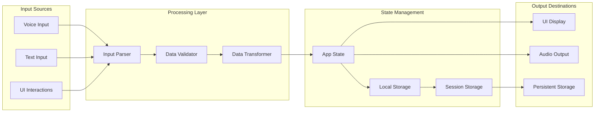

# Design Document: CogniLearn AI

## Software Design Document: CogniLearn AI

### 1. Architecture Overview

CogniLearn AI is a client-side, Single Page Application (SPA) built using React. It operates on a Serverless/API-First architecture, relying on browser-native capabilities for voice processing and Google's Gemini API for intelligence.

#### 1.1. High-Level Diagram

```
[User Voice] <-> [Web Speech API (Browser)] <-> [React Application State] <-> [Gemini 1.5 Flash API]
     ^                                              |
     |                                              v
[Microphone UI]                                [Dynamic Visualizer & Content Renderers]
```

#### 1.2. Core Design Principles

**Voice-First Priority:** The architecture treats voice input as a primary citizen, not an addon. State management must handle asynchronous voice streams without blocking the UI.

**Strict Mode Outputs:** The AI interaction layer is designed to enforce structured data (JSON) over unstructured text to enable rich UI rendering (flashcards, timelines, etc.).

**Stateless API Interactions:** The application manages conversation history locally (historyLog and messages state), sending relevant context to the stateless Gemini API only when necessary.

### 2. Component Architecture

The application follows a monolithic component structure (due to the Single-File constraint) but is logically divided into distinct modules.

#### 2.1. Main Component (App)

The root container that holds the global state:
- **State:** activeTab, language, messages, isMicEnabled
- **Refs:** recognitionRef (Speech), synthRef (TTS), stateRef (For event listener synchronization)

#### 2.2. Functional Modules (Renderers)

These sub-components render data based on the activeTab state:

| Component | Responsibility | Props/Data Source |
|-----------|---------------|-------------------|
| VoiceVisualizer | Renders the "Face" of the AI. Animations for Listening, Speaking, and Processing states | isSpeaking, isMicEnabled, language |
| SidebarItem | Navigation buttons with active state highlighting | icon, label, onClick |
| Flashcard | 3D flip-card animation for study terms | {front, back} JSON object |
| QuizQuestion | Interactive multiple-choice card with validation logic | {question, options, correctAnswer} JSON |
| ResumeRenderer | Transforms Markdown text into a styled HTML document | Markdown String |
| ToolsColumn | Renders lists of AI tools (Free vs Paid) | {name, description} JSON arrays |
| Omnibar | Bottom input area handling text input and the Floating Mic Button | inputText, handleSendMessage |

### 3. Data Flow & Logic

#### 3.1. The Voice Loop (The "Jarvis" Engine)

1. **Input:** SpeechRecognition captures audio continuously
2. **Interim Handling:** As the user speaks, text is buffered into accumulatedBuffer and displayed immediately in the Omnibar (Interim Feedback)
3. **Debounce (The 10s Rule):**
   - When silence is detected, a setTimeout (10s) begins
   - If speech resumes, clearTimeout fires, and the buffer grows
   - If timeout completes, handleSendMessage is triggered with the full buffer
4. **Output:** AI Text response is passed to SpeechSynthesis for TTS output

#### 3.2. Intent Detection & Routing

Before calling the API, the system analyzes the user's text input to determine the targetTab:
- **Logic:** `if (text.includes("flashcard")) setTargetTab('flashcards')`
- **Context Switch:** If the targetTab differs from activeTab, the switchTab function clears all current data (Flashcards, Quiz Data, etc.) to present a "Blank State"

#### 3.3. Prompt Engineering Strategy

The application uses dynamic system prompts injected based on the active feature:
- **Default:** "Helpful Assistant"
- **Flashcards:** "Return strictly valid JSON with front and back keys"
- **Resume:** "Act as a professional writer. Interview the user step-by-step"
- **Interview:** "Act as a strict interviewer. Rate answers 1-10"

### 4. State Management Strategy

#### 4.1. The "Stale Closure" Solution

Voice event listeners in React often capture old state values. To solve this:
- **useRef Pattern:** A stateRef object is updated inside a useEffect whenever state changes
- The Voice Listener reads from stateRef.current instead of direct state variables to ensure it always knows the current resumeStep or activeTab even inside async callbacks

#### 4.2. Feature Isolation

Each feature has its own dedicated state variable (e.g., resumeData, studyPlan, codeResult). Switching tabs resets these specific variables to null or empty arrays to ensure clean UI transitions.

### 5. UI/UX Design System

#### 5.1. Color Palette (Tailwind CSS)

- **Background:** bg-slate-950 (Deep Space Dark)
- **Primary Accent:** text-cyan-400 / bg-cyan-600 (Futuristic Blue)
- **Secondary Accent:** text-purple-400 (Creative/AI)
- **Status Indicators:**
  - 🔴 Red Pulse: Listening / Recording
  - 🟡 Amber Pulse: Waiting (Debounce timer active)
  - 🔵 Blue Pulse: Speaking / Processing

#### 5.2. Visual Metaphors

- **Glassmorphism:** Sidebar and Cards use semi-transparent backgrounds (bg-slate-900/90) with subtle borders to create depth
- **The Brain Orb:** The central visualizer acts as the focal point, mimicking a living entity that reacts to user voice activity

#### 5.3. Responsive Layout

- **Sidebar:** Fixed width (w-72) on desktop
- **Main Content:** Flex-grow area with overflow-y-auto
- **Omnibar:** Fixed position at the bottom with a gradient fade-out background to ensure readability over scrolling content

### 6. Security & Error Handling

#### 6.1. API Resilience

**Exponential Backoff:** If the Gemini API returns a 429 (Rate Limit) or 500 error, the makeRequest function retries up to 3 times with increasing delays (2^n seconds).

#### 6.2. Input Sanitization

**JSON Cleaning:** The cleanJson utility strips Markdown code fences (```json ... ```) from AI responses before parsing to prevent JSON.parse crashes.

#### 6.3. Audio Permission Handling

If audio-capture or not-allowed errors occur, the app gracefully degrades:
- Sets isMicEnabled to false
- Notifies the user via chat
- Allows text-only interaction via the Omnibar

## Overview

CogniLearn AI is a comprehensive voice-activated learning platform built as a single React application that serves Indian students with multilingual support and AI-powered educational tools. The system combines voice interaction, career guidance, and active learning in a unified dashboard with a focus on accessibility and regional language support.

The architecture follows a component-based design with centralized state management, voice processing pipeline, and modular learning tools. The application uses React 18 functional components with hooks for state management, Tailwind CSS for styling with glassmorphism aesthetics, and integrates Google Gemini API for AI capabilities alongside native Web Speech API for voice interaction.

## Architecture

### High-Level Architecture

```mermaid
graph TB
    subgraph "User Interface Layer"
        UI[Main Dashboard]
        Sidebar[Navigation Sidebar]
        Orb[Voice Status Orb]
        LoadingStates[Loading Indicators]
    end
    
    subgraph "Voice Processing Layer"
        VoiceManager[Voice Manager]
        SpeechRec[Speech Recognition]
        SpeechSyn[Speech Synthesis]
        IntentDetector[Intent Detection]
        LanguageSwitch[Language Switcher]
    end
    
    subgraph "AI Services Layer"
        GeminiAPI[Google Gemini API]
        LanguageProcessor[Multi-Language Processor]
        ContentGenerator[Content Generator]
        RetryLogic[Exponential Backoff]
    end
    
    subgraph "Learning Tools Layer"
        ResumeBuilder[Resume Builder]
        StudyPlanner[Study Planner]
        MockInterview[Mock Interview]
        FlashCards[Flash Cards]
        QuizEngine[Quiz Engine]
        CodingAssistant[Coding Assistant]
        JobFinder[Job Finder]
        ProfileBuilder[Profile Builder]
        AIToolsFinder[AI Tools Finder]
    end
    
    subgraph "State Management"
        AppState[Application State]
        VoiceState[Voice State]
        ToolStates[Tool States]
        SessionPersistence[Session Storage]
    end
    
    subgraph "Error Handling"
        ErrorBoundary[Error Boundary]
        RecoverySystem[Recovery System]
        FallbackUI[Fallback UI]
    end
    
    UI --> VoiceManager
    VoiceManager --> SpeechRec
    VoiceManager --> SpeechSyn
    VoiceManager --> IntentDetector
    VoiceManager --> LanguageSwitch
    IntentDetector --> UI
    
    VoiceManager --> GeminiAPI
    GeminiAPI --> LanguageProcessor
    GeminiAPI --> ContentGenerator
    GeminiAPI --> RetryLogic
    
    UI --> ResumeBuilder
    UI --> StudyPlanner
    UI --> MockInterview
    UI --> FlashCards
    UI --> QuizEngine
    UI --> CodingAssistant
    UI --> JobFinder
    UI --> ProfileBuilder
    UI --> AIToolsFinder
    
    AppState --> UI
    VoiceState --> VoiceManager
    ToolStates --> ResumeBuilder
    ToolStates --> StudyPlanner
    ToolStates --> MockInterview
    AppState --> SessionPersistence
    
    ErrorBoundary --> RecoverySystem
    RecoverySystem --> FallbackUI
    UI --> ErrorBoundary
```



### Detailed Component Architecture



### Component Architecture

The application follows a single-file architecture (OneFile.jsx) with the following component hierarchy:

- **App Component**: Main container managing global state and voice initialization
- **VoiceOrb**: Visual status indicator for voice assistant state
- **Sidebar**: Permanent navigation with 15+ tool options
- **MainContent**: Dynamic content area that renders active tool
- **Learning Tools**: Individual components for each educational feature
- **VoiceManager**: Centralized voice processing and intent detection

### Voice Processing Pipeline



### Resume Builder State Machine Flow



### Study Planner Adaptation Flow



### Mock Interview Flow



### Intent Detection and Navigation Flow



### Language Switching Architecture



### Error Handling and Recovery Flow



### Data Flow Architecture



## Components and Interfaces

### Core Components

#### VoiceManager Component
```typescript
interface VoiceManagerProps {
  onIntentDetected: (intent: Intent) => void;
  currentLanguage: SupportedLanguage;
  isActive: boolean;
}

interface VoiceState {
  isListening: boolean;
  isProcessing: boolean;
  interimResults: string;
  finalResults: string;
  error: string | null;
}
```

#### VoiceOrb Component
```typescript
interface VoiceOrbProps {
  status: 'idle' | 'listening' | 'processing';
  size?: 'small' | 'medium' | 'large';
  className?: string;
}
```

#### Learning Tool Interface
```typescript
interface LearningTool {
  id: string;
  name: string;
  icon: LucideIcon;
  component: React.ComponentType;
  voiceCommands: string[];
  description: string;
}
```

### Voice Processing Interfaces

#### Speech Recognition Interface
```typescript
interface SpeechRecognitionConfig {
  language: SupportedLanguage;
  continuous: boolean;
  interimResults: boolean;
  maxAlternatives: number;
}

interface SpeechResult {
  transcript: string;
  confidence: number;
  isFinal: boolean;
}
```

#### Intent Detection Interface
```typescript
interface Intent {
  type: 'navigation' | 'action' | 'query';
  target: string;
  parameters: Record<string, any>;
  confidence: number;
}

interface IntentDetectionResult {
  intent: Intent;
  shouldNavigate: boolean;
  response: string;
}
```

### Learning Tool Interfaces

#### Resume Builder Interface
```typescript
interface ResumeState {
  currentStep: ResumeStep;
  data: ResumeData;
  isComplete: boolean;
}

type ResumeStep = 'jobRole' | 'name' | 'education' | 'experience' | 'skills' | 'projects' | 'hobbies';

interface ResumeData {
  jobRole: string;
  personalInfo: PersonalInfo;
  education: EducationEntry[];
  experience: ExperienceEntry[];
  skills: string[];
  projects: ProjectEntry[];
  hobbies: string[];
}
```

#### Study Planner Interface
```typescript
interface StudyPlan {
  id: string;
  title: string;
  duration: number; // in days
  tasks: StudyTask[];
  generatedAt: Date;
  lastModified: Date;
}

interface StudyTask {
  id: string;
  title: string;
  description: string;
  estimatedTime: number; // in minutes
  status: 'pending' | 'completed' | 'missed' | 'revision';
  dueDate: Date;
  priority: 'low' | 'medium' | 'high';
}
```

#### Mock Interview Interface
```typescript
interface InterviewSession {
  id: string;
  questions: InterviewQuestion[];
  currentQuestionIndex: number;
  responses: InterviewResponse[];
  overallScore: number;
  isComplete: boolean;
}

interface InterviewQuestion {
  id: string;
  text: string;
  category: 'technical' | 'behavioral' | 'situational';
  expectedDuration: number; // in seconds
}

interface InterviewResponse {
  questionId: string;
  userResponse: string;
  aiRating: number; // 1-10
  feedback: string;
  suggestions: string[];
}
```

### API Integration Interfaces

#### Gemini API Interface
```typescript
interface GeminiRequest {
  prompt: string;
  language: SupportedLanguage;
  context?: string;
  maxTokens?: number;
}

interface GeminiResponse {
  content: string;
  confidence: number;
  usage: {
    promptTokens: number;
    completionTokens: number;
  };
}
```

#### Language Support Interface
```typescript
type SupportedLanguage = 'en-IN' | 'hi-IN' | 'kn-IN' | 'ta-IN' | 'te-IN';

interface LanguageConfig {
  code: SupportedLanguage;
  name: string;
  speechRecognitionCode: string;
  speechSynthesisVoice: string;
  rtl: boolean;
}
```

## Data Models

### User Profile Model
```typescript
interface UserProfile {
  id: string;
  name: string;
  email: string;
  preferredLanguage: SupportedLanguage;
  educationLevel: string;
  interests: string[];
  careerGoals: string[];
  createdAt: Date;
  lastActive: Date;
}
```

### Session State Model
```typescript
interface SessionState {
  currentTool: string;
  voiceEnabled: boolean;
  language: SupportedLanguage;
  toolStates: Record<string, any>;
  conversationHistory: ConversationEntry[];
}

interface ConversationEntry {
  timestamp: Date;
  userInput: string;
  aiResponse: string;
  intent: Intent;
  language: SupportedLanguage;
}
```

### Learning Progress Model
```typescript
interface LearningProgress {
  userId: string;
  toolUsage: Record<string, ToolUsageStats>;
  studyPlans: StudyPlan[];
  completedInterviews: InterviewSession[];
  flashcardSets: FlashcardSet[];
  overallProgress: ProgressMetrics;
}

interface ToolUsageStats {
  toolId: string;
  totalSessions: number;
  totalTimeSpent: number; // in minutes
  lastUsed: Date;
  proficiencyLevel: number; // 1-10
}

interface ProgressMetrics {
  totalLearningTime: number;
  skillsAcquired: string[];
  goalsCompleted: number;
  streakDays: number;
}
```

### Content Models

#### Flashcard Model
```typescript
interface FlashcardSet {
  id: string;
  title: string;
  description: string;
  cards: Flashcard[];
  category: string;
  difficulty: 'beginner' | 'intermediate' | 'advanced';
  createdAt: Date;
}

interface Flashcard {
  id: string;
  front: string;
  back: string;
  tags: string[];
  reviewCount: number;
  lastReviewed: Date;
  easeFactor: number; // for spaced repetition
}
```

#### Quiz Model
```typescript
interface Quiz {
  id: string;
  title: string;
  questions: QuizQuestion[];
  timeLimit: number; // in minutes
  category: string;
  difficulty: 'easy' | 'medium' | 'hard';
}

interface QuizQuestion {
  id: string;
  text: string;
  type: 'multiple-choice' | 'true-false' | 'short-answer';
  options?: string[];
  correctAnswer: string | string[];
  explanation: string;
  points: number;
}
```

#### Job Listing Model
```typescript
interface JobListing {
  id: string;
  title: string;
  company: string;
  location: string;
  type: 'full-time' | 'part-time' | 'internship' | 'contract';
  description: string;
  requirements: string[];
  skills: string[];
  salaryRange: {
    min: number;
    max: number;
    currency: string;
  };
  postedDate: Date;
  applicationDeadline: Date;
}
```

### Error Handling Models
```typescript
interface AppError {
  code: string;
  message: string;
  details?: any;
  timestamp: Date;
  context: {
    component: string;
    action: string;
    userId?: string;
  };
}

interface VoiceError extends AppError {
  type: 'recognition' | 'synthesis' | 'permission' | 'network';
  recoverable: boolean;
  retryCount: number;
}
```

## Correctness Properties

*A property is a characteristic or behavior that should hold true across all valid executions of a system—essentially, a formal statement about what the system should do. Properties serve as the bridge between human-readable specifications and machine-verifiable correctness guarantees.*

### Property 1: Voice Assistant Initialization Completeness
*For any* voice assistant instance, when initialized, it should have continuous speech recognition enabled, auto-restart capability configured, and support for all required languages (English India, Hindi, Kannada, Tamil, Telugu).
**Validates: Requirements 1.1, 1.6**

### Property 2: Speech Processing Timing Rules
*For any* speech input, if the command contains fewer than 3 words, it should be processed immediately without debounce delay, and if it contains 3 or more words, it should apply a 10-second debounce before processing.
**Validates: Requirements 1.4, 1.5**

### Property 3: Voice Status Visual Mapping
*For any* voice assistant state (idle, listening, processing), the orb component should display the corresponding color (red for idle, yellow for listening, cyan for processing) with smooth 300ms transitions.
**Validates: Requirements 2.1, 2.2, 2.3, 2.4**

### Property 4: Resume Builder State Machine Flow
*For any* resume building session, completing each section should advance to the next section in the correct sequence (Job Role → Name → Education → Experience → Skills → Projects → Hobbies), and completing all sections should generate valid markdown output.
**Validates: Requirements 3.1, 3.2, 3.3**

### Property 5: Resume Format Round Trip
*For any* completed resume data, converting to markdown and then rendering as HTML should preserve all essential information and structure.
**Validates: Requirements 3.4**

### Property 6: Study Plan Adaptation Behavior
*For any* study plan, marking tasks as "Missed" should trigger plan regeneration that preserves completed tasks while adjusting future tasks, and marking tasks as "Revise" should add appropriate review sessions.
**Validates: Requirements 4.2, 4.3, 4.4**

### Property 7: Study Plan JSON Generation
*For any* study plan request, the system should generate valid JSON-formatted study schedules that can be parsed and contain all required fields (tasks, timing, priorities).
**Validates: Requirements 4.1**

### Property 8: Mock Interview Flow Completeness
*For any* mock interview session, the system should present distinct avatars for interviewer and user, provide ratings and feedback for each answer, and generate overall scores with improvement recommendations upon completion.
**Validates: Requirements 5.1, 5.3, 5.4, 5.5, 5.6**

### Property 9: Learning Tool Animation Consistency
*For any* learning tool interaction (flashcard flips, quiz feedback, coding terminal display), the system should provide the appropriate visual animations and interface styling as specified for each tool type.
**Validates: Requirements 6.1, 6.2, 6.4**

### Property 10: Intent Detection and Navigation
*For any* voice input containing tool-related intents, the intent detector should correctly identify the target feature and automatically navigate to the corresponding tool while providing voice confirmation.
**Validates: Requirements 7.1, 7.2, 7.3**

### Property 11: State Preservation Across Navigation
*For any* tool switching operation, the system should preserve the current state of each tool and maintain conversation history for context continuity.
**Validates: Requirements 7.5, 11.1, 11.5**

### Property 12: Language System Coordination
*For any* language selection change, both speech recognition and synthesis engines should update within 1 second, and all system functionality should remain equivalent across all supported languages.
**Validates: Requirements 1.7, 8.1, 8.2, 8.4**

### Property 13: Language Response Consistency
*For any* AI-generated response, the output language should match the user's currently selected language, and conversation context should be preserved across language switches.
**Validates: Requirements 8.3, 8.5**

### Property 14: Profile Analysis Quality
*For any* profile optimization request (LinkedIn or GitHub), the system should provide specific, actionable recommendations with explanatory reasoning for each suggestion.
**Validates: Requirements 9.1, 9.2, 9.5**

### Property 15: Job Matching Relevance
*For any* job search request, the returned listings should be relevant to the user's skills and interests as defined in their profile data.
**Validates: Requirements 9.3**

### Property 16: API Retry Behavior
*For any* failed API call, the system should implement exponential backoff retry logic with exactly 3 attempts and increasing delays between retries.
**Validates: Requirements 10.1, 10.3**

### Property 17: Error Handling Completeness
*For any* system error (audio capture failure, API failure, etc.), the system should provide both clear error messages and recovery options, with both visual and audio feedback for accessibility.
**Validates: Requirements 10.2, 12.4**

### Property 18: Performance Response Times
*For any* feature switching operation, the system should complete the transition within 500ms while maintaining responsive UI with appropriate loading indicators for blank states.
**Validates: Requirements 10.5, 10.6**

### Property 19: Data Persistence Consistency
*For any* user data modification (study plans, resume drafts, conversation history), changes should be saved immediately to prevent data loss, and session state should be restorable after application refresh.
**Validates: Requirements 11.2, 11.3, 11.4**

### Property 20: Accessibility Feature Coverage
*For any* voice-enabled feature, alternative text input methods should be available, and all interactive elements should support keyboard navigation with appropriate audio announcements for state changes.
**Validates: Requirements 12.1, 12.2, 12.3**

### Property 21: Speech Recognition Recovery
*For any* unexpected speech recognition failure, the system should automatically restart within 2 seconds and display real-time interim results during active recognition.
**Validates: Requirements 1.2, 1.3**

### Property 22: UI Visibility and Navigation Completeness
*For any* application state, the orb component should remain visible during voice interaction, the sidebar should display all 15+ navigation items, and seamless navigation should be available between all learning tools.
**Validates: Requirements 2.5, 6.6, 7.4**

## Error Handling

### Voice Processing Error Handling

The system implements comprehensive error handling for voice-related operations:

**Speech Recognition Errors:**
- Permission denied: Request microphone access with clear user guidance
- Network failures: Implement offline mode with cached responses where possible
- Recognition failures: Automatic restart with exponential backoff
- Language not supported: Fallback to English with user notification

**Speech Synthesis Errors:**
- Voice not available: Fallback to default system voice
- Synthesis failures: Display text alternative with retry option
- Audio output blocked: Show visual indicators as backup

### API Integration Error Handling

**Gemini API Error Handling:**
- Rate limiting: Exponential backoff with user-friendly waiting indicators
- Authentication failures: Clear error messages with resolution steps
- Network timeouts: Retry logic with progressive timeout increases
- Invalid responses: Graceful degradation with cached or default content

**Error Recovery Strategies:**
- Automatic retry with exponential backoff (max 3 attempts)
- Graceful degradation to offline functionality where possible
- Clear user communication about error states and recovery actions
- Persistent error logging for debugging and improvement

### Data Persistence Error Handling

**Local Storage Errors:**
- Storage quota exceeded: Cleanup old data with user consent
- Storage unavailable: In-memory fallback with session-only persistence
- Corruption detection: Data validation with recovery from backups

**State Management Errors:**
- Invalid state transitions: Reset to known good state with user notification
- Concurrent modification: Conflict resolution with user choice
- Memory leaks: Cleanup listeners and references on component unmount

## Testing Strategy

### Dual Testing Approach

The testing strategy employs both unit testing and property-based testing to ensure comprehensive coverage:

**Unit Testing Focus:**
- Specific examples demonstrating correct behavior
- Edge cases and error conditions
- Integration points between components
- User interface interactions and animations
- API integration scenarios

**Property-Based Testing Focus:**
- Universal properties that hold for all inputs
- Voice processing behavior across different languages
- State machine transitions in resume builder and study planner
- Data consistency across tool switches
- Error recovery and retry mechanisms

### Property-Based Testing Configuration

**Testing Framework:** Fast-check (for JavaScript/TypeScript property-based testing)
**Configuration Requirements:**
- Minimum 100 iterations per property test
- Each property test references its corresponding design document property
- Tag format: **Feature: cognilearn-ai, Property {number}: {property_text}**

**Example Property Test Structure:**
```typescript
// Feature: cognilearn-ai, Property 1: Voice Assistant Initialization Completeness
test('voice assistant initialization includes all required components', () => {
  fc.assert(fc.property(
    fc.record({
      language: fc.constantFrom('en-IN', 'hi-IN', 'kn-IN', 'ta-IN', 'te-IN'),
      continuous: fc.boolean(),
      autoRestart: fc.boolean()
    }),
    (config) => {
      const voiceAssistant = initializeVoiceAssistant(config);
      expect(voiceAssistant.hasContinuousRecognition()).toBe(true);
      expect(voiceAssistant.hasAutoRestart()).toBe(true);
      expect(voiceAssistant.getSupportedLanguages()).toContain(config.language);
    }
  ), { numRuns: 100 });
});
```

### Testing Coverage Areas

**Voice Processing Testing:**
- Speech recognition accuracy across languages
- Intent detection and classification
- Voice synthesis quality and timing
- Error recovery and restart mechanisms

**Learning Tools Testing:**
- Resume builder state machine transitions
- Study planner adaptation algorithms
- Mock interview scoring and feedback
- Flashcard and quiz interaction flows

**Integration Testing:**
- API communication with Gemini
- Cross-component state management
- Navigation and tool switching
- Data persistence and recovery

**Accessibility Testing:**
- Keyboard navigation completeness
- Screen reader compatibility
- Alternative input method availability
- Audio-visual feedback coordination

**Performance Testing:**
- Response time requirements (< 500ms for navigation)
- Memory usage during extended sessions
- API rate limiting and backoff behavior
- Large dataset handling (study plans, conversation history)

### Test Data Generation

**Voice Input Simulation:**
- Generate test phrases in all supported languages
- Create various command lengths for debounce testing
- Simulate recognition errors and recovery scenarios

**User Profile Generation:**
- Random skill sets and interests for job matching
- Various education levels and career goals
- Different language preferences and accessibility needs

**Content Generation:**
- Study plan variations with different subjects and timelines
- Resume data with various experience levels
- Interview questions across different categories and difficulties

The testing strategy ensures that all correctness properties are validated through automated tests, providing confidence in the system's reliability and correctness across all supported use cases and languages.